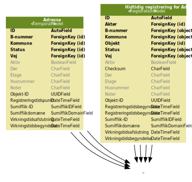

================================
Grønlands Adresseopslagsregister
================================

Dette dokument giver et overblik over Grønlands Adresseopslagsregister
og dets integration med Grønlands Datafordeler.

Grønlands Adresseopslagsregister er bygget til at være den
autoritative database for adresser i Grønland og stedet hvor
sagsbehandlere opretter og vedligeholder adresser.

Formålet med projektet og arbejdspakken var at løse opgaven ved hjælp
af et relativt standardiseret site bygget på Django1 og dets
administrationsinterface. Det overordnede konceptuelle design såvel
som den overordnede arkitektur for koden er dikteret af Django, og
dette dokument vil derfor i højere grad fokusere på den anvendte
datamodel samt de justeringer vi foretog for at tilpasse Django til
vore behov. Derudover vil vi beskrive selve systemet og dets
anvendelse.

Overordnet datamodel
====================

   Klasser og relationer.

På figuren ovenfor vises vores datamodel med samt relationerne mellem
de enkelte klasser. [#overskuelighed]_ Det er værd at bemærke at
*virkningstidsbegyndelse* samt *virkningstidsafslutning* ikke anvendes
endnu. Derudover er der til hver model tilknyttet en
registreringstabel der indeholder samme oplysninger, samt historikken
derfor; dette beskrives nærmere senere.

En vigtig opdeling i datamodellen er mellem *generelle* objekter hvor
den autoritative sandhed vedligeholdes andetsteds, og *lokale*
objekter som tilhører en kommune. De lokale objektklasser er:

 • Adresse
 • B-nummer
 • Vej

Slutteligt skal det bemærkes at vi har en ekstra klasse,
*Kommunerettigheder*, som kobler en almindelig bruger til den eller de
kommuner vedkommende har adgang til.

Temporale modeller
==================

   Eksempel på almindelig og temporal model for adresseklassen.

Alle vores modeller anvender en Python metaklasse [#metaklasse]_ til at
vedligeholde registreringshistorik for den enkelte model. Dette sørger
for at alle hidtidige registreringer gemmes for eftertiden, og at man
kan koble en hvilket som helst registrering til den bruger som foretog
den. Registreringer gemmes i en seperat tabel, som gemmer en dublet af
data samt en henvisning til det nugældende objekt. I denne forstand
følger vi anbefalingerne i »Bitemporalitet — Proof of
concept« [#bitemp]_ fysisk datamodel 1d.

Vores modeller er forberedt til at understøtte bitemporalitet — såvel
registreringstid som virkningstid — men vi understøtter ikke
virkningstid endnu. Som en del af synkronisering antages at alle
registrering har øjeblikkelig virkning; med andre ord at
registreringstid og virkningstid er overlappende for alle
registreringer. Yderligere detaljer om synkronisering beskrives
senere.

Bemærk at modellerne for rettighedsstyring, dvs. Brugere og
Kommunerettigheder, modsat de andre klasser ikke er temporale. Djangos
indbyggede historik muliggør dog at man alligevel kan at se hvilke
ændringer der foretages.

Slutteligt skal det tillige bemærkes vi ikke eksponerer de temporale
aspekter af vores datamodel i brugerfladen endnu.

Adgangskontrol
==============

Vi anvender i Adresseopslagsregistret Djangos indbyggede
autentificering og brugerstyring; SAML-autentificering er ikke
inkluderet i denne leverance. Django tilbyder et fintmasket system for
rettigheder og grupper, som vi dog ikke anvender, og har skjult i
brugerfladen.

Django har tre niveauer af adgangskontrol:

• Superbruger
• Admin-status
• Almindelig

Derudover kan være bruger være *aktiv* eller *inaktiv*. Superbrugere kan
slette de enkelte brugere så længe den pågældende bruger ikke har
foretaget nogen ændringer; herefter henviser de udførte registreringer
til brugeren, og den kan udelukkende deaktiveres. Superbrugere har
adgang til hele systemet og kan rette i al data; de kan sågar slette
objekter, så længe referencemæssig integritet opretholdes. De kan dog
hverken rette i eller slette registreringer.

Administrative rettigheder kaldes *Admin-status* i Django, og tillader
en bruger at anvende den administrative brugergrænseflade. Vi har
justeret adgangskontrollen således at en bruger ikke har adgang til
nogle objekter, førend den pågældende bruger tilknyttes en
*Kommunerettighed*. Derefter har brugeren adgang til at oprette og
rette objekter knyttet til den pågældende kommune.

Almindelige brugere har begrænset anvendelighed i dette system; de har
ikke adgang til den administrative brugergrænseflade, men kan tilgå
det øvrige system. På sigt kan dette anvendes til servicebrugere til
synkronisering.

Øvrige tilpasninger af Django
=============================

Vi har foretaget visse justeringer af Django som beskrevet i de
følgende afsnit.

Styringskommando
----------------

Django anvender konventionelt et script ved navn manage.py som
centralt indgangspunkt til at styre, køre og udvikle webapplikationen.
Vi har justeret dette script så det automatisk opretter et virtuelt
miljø,[#miljø]_ installerer de krævede pakker og kører kommandoen under det.
Derudover har vi tilføjet et par kommandoer til det:

    • ``import`` indlæser data fra et excelregneark til databasen.
    • ``babelcompilemessages`` kompilerer oversatte tekstrenge til et
      binært format. Den gængse djangokommando anvender *GNU gettext*
      som typisk ikke er tilgængeligt på Windows.
    • ``push`` notificerer Grønlands Datafordeler om udestående
      ændringer.

Anvendte udvidelser
-------------------

Django tilbyder et meget fleksibelt miljø, og tredjepartsudvidelser
anvendes ofte til at udvide eller ændre eksisterende funktionalitet.
Vi anvender følgende udvidelser:

• ``django_extensions`` tilbyder forskellig funktionalitet. Vi
  anvender især deres autocompletefunktionalitet samt muligheden for
  at generere grafer ud fra datamodeller.
• ``admin_reorder`` tillader os at omorganisere oversigten på den
  administrative brugergrænseflade, så *brugere* og
  *kommunerettigheder* grupperes adskilt fra andre typer.

Øvrige ændringer
----------------

• Vi har tilføjet en præsentabel fejlside hvis en bruger forsøger at
  tilgå en side som vedkommende ikke har rettigheder til.
• I et umodificeret djangosystem vil brugeroprettelse resultere i en
  *almindelig* bruger. Dermed er en ny bruger umiddelbart relativt
  ubrugelig, med mindre den superbruger der oprettede bruger huskede
  at tilføje de krævede rettigheder bagefter. Vi har justeret
  standardformularerne til brugeroprettelse, således at man spørges om
  brugeren skal være administrator og superbruger samtidig med at man
  indtaster et nyt kodeord. Man vil dog stadig eksplicit skulle give
  brugeren adgang til de relevante kommuner.

Synkronisering med Grønlands Datafordeler
=========================================

Manuelt *push*
--------------

En konsolkommando, ``push``, initierer en synkronisering til en kørende datafordeler, andgivet med parametrene –host og –path. F.eks. kan følgende eksekveres::

  ./manage.py push –host https://data.gl –path /odata/gapi/Events

Alle data af typerne *State*, *Municipality*, *District*,
*PostalCode*, *Locality*, *BNumber*, *Road* og *Address* hvor der ikke
allerede foreligger en kvittering, bliver så hentet frem, serialiseret
til JSON, indpakket i en beskedkuvert og sendt til den angivne
datafordeler med POST-requests.

Datafordeleren lytter efter sådanne requests og behandler dem
efterhånden som de kommer ind. Hver forespørgel udpakkes, og de
indeholdte data parses og indsættes i datafordeleren. En kvittering
sendes til den adresse som er konfigureret i datafordeleren, uanset om
operationen lykkedes eller ej med relevant status i kvitteringen.

Automatisk *push*
-----------------

*Pull*
------

Datafordeleren kan også konfigureres til at hente data fra
adresseregisteret på bestemte tidspunkter, eksempelsvist hver dag ved
midnat. Dette vil udmønte sig i et GET-request til adresseregistret på
stien ``/getNewEvents``. Adresseregisteret svarer så med en
JSON-struktur, der angiver en liste af objektreferencer for objekter
som endnu ikke har modtaget en kvittering. Ud fra disse referencer kan
datafordeleren så hente objekterne og behandle dem som ved *push*.

Licens og anvendt software
==========================

Grønlands Adresseopslagsregister er frigivet under `Mozilla Public
Licence, version 2.0`_. En liste over afhængigheder fremstår i
kildekoden, på følgende adresse:

• https://github.com/magenta-aps/gladdrreg/blob/master/setup.py

.. _Mozilla Public Licence, version 2.0: https://www.mozilla.org/en-US/MPL/2.0/

Den primære afhængighed er Python 3.5 eller senere, og tjenesten er
også testet med Python 3.6.

.. [#overskuelighed] Af hensyn til overskuelighed er de temporale
   tabeller udeladt.

.. [#metaklasse] Metaklasser i Python er en form for type factory;
   subklasser af typen type som kan kaldes hver gang man opretter en
   ny klasse. Det tillader os at genere to modeller og tabeller for
   hver klasse i koden på trods af at Django ellers kobler klasser,
   modeller og tabeller relativt hårdt sammen. Se også Pythons online
   dokumentation om klasseoprettelse på
   <https://docs.python.org/3.5/reference/datamodel.html#customizing-class-creation>.

.. [#venv]
   Virtuelle miljøer i Python muliggør installation af pakker lokalt
   til den enkelte installation snarere end på hele systemet.
   Se også <https://docs.python.org/3.5/library/venv.html>.

.. [#bitemp] *»Bitemporalitet — Proof of concept«*, version 1.2, 19.
   sept. 2014, afsnit 4.2.4.
   <http://arkitekturguiden.digitaliser.dk/sites/default/files/ctools/bitemporalitet-v1.2.pdf>
